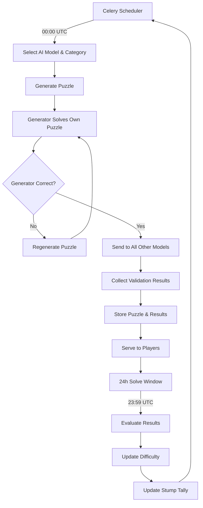

# AI Puzzle Game - Core Concepts & Architecture

## Game Overview
A daily puzzle game where AI models compete to stump human players. The system automatically adjusts difficulty based on community performance, creating a dynamic challenge that evolves with player skill.

## Core Mechanics

### The Daily Cycle
- **00:00 UTC**: AI generates today's puzzle at current difficulty level
- **Validation**: All AI models attempt to solve the generated puzzle
- **Quality Check**: Puzzle published only if generator can solve it correctly
- **24-hour window**: Players attempt to solve
- **23:59 UTC**: Results evaluated, difficulty adjusted for tomorrow
- **Repeat**: New AI model takes turn generating next puzzle

### Dynamic Difficulty System
```
Difficulty Index: 0.00 → 1.00
├─ Mini (0.00-0.39): Beginner friendly
├─ Mid (0.40-0.69): Standard challenge  
└─ Beast (0.70-1.00): Expert level

Update Rule: D = clamp(D ± 0.05)
- Community solves → Harder tomorrow (+0.05)
- AI stumps everyone → Easier tomorrow (-0.05)
```

### AI Model Competition
Multiple AI models rotate as puzzle generators:
- GPT-4o, Claude 3, Gemini (expandable)
- Public **Stump Tally** tracks which models best challenge humans
- Future: Weight rotation based on historical performance

## Architecture

### Tech Stack
```
Frontend: React
Backend: Django REST API
Database: Postgres
Workers: Celery (scheduled tasks)
Validation: Microservice
```

### System Flow


### Data Models

#### Puzzle Schema
```json
{
  "id": "2025-08-03",
  "category": "math|word|art",
  "difficulty": 0.58,
  "generator_model": "claude-3",
  "puzzle_content": {
    "question": "Solve for x: 3x² + 7x - 20 = 0",
    "media_url": null,
    "constraints": {}
  },
  "solution": "x = 5/3 or x = -4",
  "generator_solution": "x = 5/3 or x = -4",
  "validator_results": {
    "gpt4o_solve": true,
    "claude3_solve": true, 
    "gemini_solve": false
  },
  "created_at": "2025-08-03T00:00:00Z"
}
```

#### Player Progress
```json
{
  "user_id": "player123",
  "puzzle_id": "2025-08-03",
  "solved": true,
  "solve_time": 127,
  "attempts": 3,
  "solved_at": "2025-08-03T14:23:15Z"
}
```

## Puzzle Categories

### Math Puzzles
**Examples:**
- Algebraic equations: "Solve for x: 3x² + 7x - 20 = 0"
- Physics problems: "A ball is thrown upward at 20 m/s. When does it hit the ground?"
- Number theory: "Find the next prime number after 1,009"
- Geometry: "What's the area of a triangle with sides 5, 12, 13?"

### Word Puzzles  
**Examples:**
- Riddles: "I have cities, but no houses. I have water, but no fish. What am I?"
- Word searches: "Find 7 animals hidden in this 10x10 grid"
- Anagrams: "Unscramble: TNERALC EGNIEN"
- Wordplay: "What 5-letter word becomes shorter when you add two letters?"

### Art Puzzles
**Examples:**
- Music identification: "Name this song from a 3-second audio clip"
- Visual recognition: "Identify the movie from this blurred poster"
- Artist identification: "Who painted this detail from a famous work?"
- Style matching: "Which art movement does this piece represent?"

## Key Features

### Player Engagement
- **Streaks**: Consecutive days solved
- **Speed Records**: Sub-minute solves
- **Community Save**: First to solve on potential stump days
- **Leaderboards**: Daily and all-time rankings

### Fair Play Guarantees
- **Generator Accountability**: AI must solve its own puzzle correctly
- **Cross-Model Validation**: All models attempt each puzzle for difficulty assessment
- **Equal Resources**: Same CPU budget and time limits for all AI generators
- **Transparent Logs**: Public generation and validation results
- **Content Filtering**: Automated screening for inappropriate content across all categories

### Scalability Considerations
- Category-agnostic validator design
- Pluggable AI model system
- Horizontal scaling via microservices
- Efficient caching for daily puzzles

## MVP Scope

### Launch Features
1. **Three Categories**: Math, Word, and Art puzzles
2. **Three AI Models**: GPT-4o, Claude 3, Gemini
3. **Core Mechanics**: Daily generation, difficulty adjustment, stump tracking
4. **Basic UI**: Puzzle interface, leaderboards, stump tally

### Post-MVP Expansion
1. **Additional Categories**: Logic puzzles, science challenges, creative tasks
2. **Advanced Rotation**: Weighted model selection based on performance
3. **Social Features**: Player profiles, achievements, sharing
4. **Analytics**: Detailed difficulty tuning, player behavior insights

## Implementation Priorities

### Phase 1: Core Engine
- [ ] Multi-category puzzle generation system
- [ ] Cross-model validation pipeline
- [ ] Generator self-solving verification
- [ ] Difficulty adjustment algorithm per category
- [ ] Media handling for art puzzles

### Phase 2: User Experience  
- [ ] React frontend with multi-category puzzle interface
- [ ] Media player for audio/visual art puzzles
- [ ] User authentication and progress tracking
- [ ] Category-specific leaderboards and statistics
- [ ] Mobile-responsive design with touch interactions

### Phase 3: Community Features
- [ ] Public stump tally dashboard
- [ ] Badge system implementation
- [ ] Social sharing capabilities
- [ ] Community feedback mechanisms

## Success Metrics
- **Daily Active Users**: Target engagement across all categories
- **Category Balance**: Ensure equal engagement across Math, Word, and Art puzzles
- **Solve Rate**: Community vs AI balance (aim for 70-80% daily solve rate per category)
- **Cross-Model Performance**: Track which models excel at generating vs solving different categories
- **Retention**: Multi-day streaks and return rates
- **Quality Metrics**: Generator self-solve success rate, cross-validation accuracy